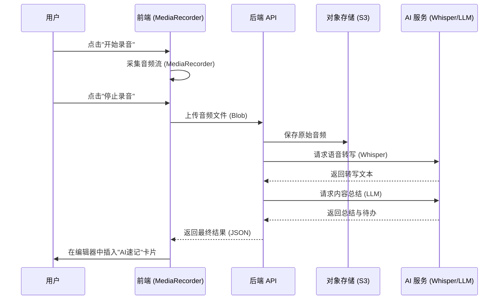

# AI 语音速记模块 (AI Shorthand)

## 概述

AI 语音速记模块允许用户直接在文档中进行语音录制，利用 AI 技术将语音实时或离线转换为文本，并自动生成结构化的会议纪要、摘要或待办事项。该功能旨在提升会议记录、灵感捕捉和访谈整理的效率。

## 功能特性

### 核心功能

1.  **语音录制**:
    *   支持浏览器端直接录音。
    *   可视化音频波形反馈。
    *   支持暂停/继续录制。
    *   录音时长限制（如 60分钟）。
2.  **语音转写 (Speech-to-Text)**:
    *   高精度语音转文字。
    *   支持多语言识别（中文、英文等）。
    *   自动区分说话人（可选）。
3.  **智能总结 (AI Summarization)**:
    *   **全文摘要**: 生成简短的核心内容概述。
    *   **结构化笔记**: 自动提取会议主题、关键论点。
    *   **待办提取**: 识别语音中的行动项 (Action Items)。
4.  **原文对照**:
    *   保留原始转写文本，支持展开/收起。
    *   点击摘要可定位到原文位置（高级特性）。

## 技术架构

### 流程设计



### 数据结构

**录音区块 (Block) 数据结构**:

```typescript
interface AIShorthandBlock {
  type: 'ai_shorthand';
  content: {
    audioUrl?: string;       // 原始音频链接
    duration?: number;       // 时长(秒)
    status: 'recording' | 'processing' | 'completed' | 'failed';
    transcript?: string;     // 转写全文
    summary?: {
      overview: string;      // 概述
      keyPoints: string[];   // 关键点
      actionItems: string[]; // 待办事项
    };
    createdAt: string;
  };
}
```

### API 设计

1.  **上传音频**:
    *   `POST /api/upload/audio`
    *   Input: `FormData (file)`
    *   Output: `{ url: string, id: string }`
2.  **处理录音**:
    *   `POST /api/ai/shorthand/process`
    *   Input: `{ audioUrl: string, language?: string }`
    *   Output: `{ transcript: string, summary: object }`

## 用户界面设计

### 1. 录音中状态
*   显示录音时长计时器 (00:00)。
*   动态声波动画。
*   操作按钮：[停止] [取消]。
*   **隐私提示**: "开始转录即表示你确认已征得所有相关人员的同意。"

### 2. 处理中状态
*   显示"AI正在转写..."进度条或加载动画。
*   允许用户在后台处理时继续编辑文档其他部分。

### 3. 完成状态 (卡片式展示)
*   **头部**: 录音时间、时长、音频播放器。
*   **摘要区**:
    *   💡 **核心观点**: ...
    *   ✅ **待办事项**: ...
*   **折叠区**: "查看完整逐字稿" (默认收起)。

### 4. UI 参考 (仿 Notion)
*   **入口**: 空行输入 `/shorthand` 或点击 "+" 菜单选择 "AI 速记"。
*   **初始态**: 卡片显示 "AI 速记"，副标题 "AI 将总结笔记和转录内容"，右侧显示 "开始录音" 按钮。
*   **布局**: 嵌入文档流的块级元素 (Block-level element)。

## 性能与限制

*   **文件大小**: 限制单次录音文件大小（如 50MB）。
*   **并发处理**: 音频处理较耗时，建议使用异步队列 (Queue) 处理。
*   **隐私安全**: 用户音频数据需加密存储，并提供定期自动删除选项。

## 后续规划

*   **实时转写**: 边录边转（Websocket流式传输）。
*   **声纹识别**: 自动标记 "发言人 A"、"发言人 B"。
*   **多文件导入**: 支持上传本地音频/视频文件进行整理。
